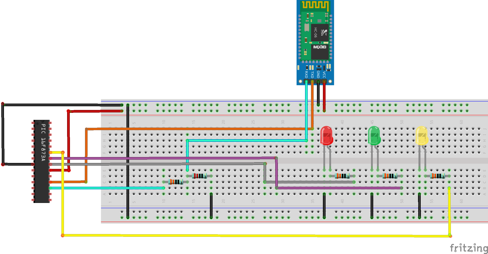
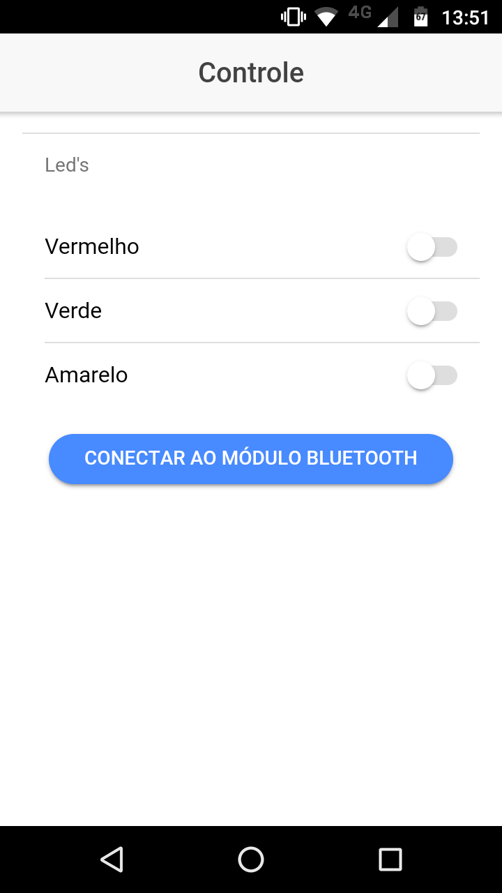

# bluetooth-pic

Este projeto foi desenvolvido como Trabalho de Conclusão de Disciplina (TCD) para a matéria de Microcontroladores da Universidade Estadual Paulista (UNESP) - Bauru, em 2017. Consiste de um aplicativo Ionic que se comunica com um módulo Bluetooth HC-06 para controlar o estado de três leds.

A pasta _Código ASM_ contém o código em Assembly desenvolvido para o PIC 16f873A, responsável por receber os dados através do módulo Bluetooth e acender os leds correspondentes que o usuário desejar.

A pasta _controlApp_ contém o aplicativo desenvolvido em Ionic 2, que através da biblioteca Bluetooth Serial (Disponível em https://github.com/don/BluetoothSerial) se comunica com um módulo HC-06, e envia um byte que determina quais leds devem estar acesos ou apagados.

A pasta _docs_ contém imagens do circuito e do aplicativo, assim como um APK do aplicativo.

## Circuito

## Aplicativo

